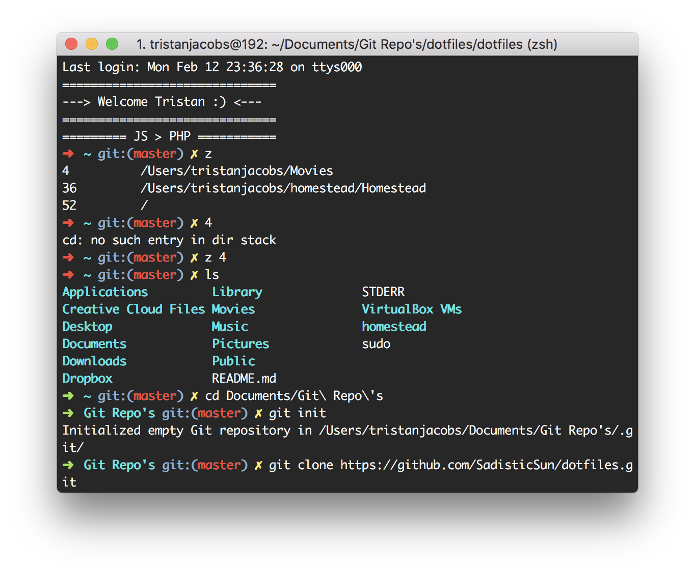

# Dotfiles

## What is this repo?
In this repository you will find my custom dotfiles for everyday use. These might contain config settings for git, shortcuts/aliases etc.

## ZSH
I use oh-my-zsh as a custom shell.
You can read all about it at https://github.com/robbyrussell/oh-my-zsh

> My current shell setup


I have used some custom aliases that I use for work:

```## Navigate to Homestead + vagrant up
alias vu="cd /Users/tristanjacobs/homestead/Homestead/ && vagrant up"

## Terminate vagrant VM
alias vh= "cd /Users/tristanjacobs/homestead/Homestead/ && vagrant halt"

## Run NPM watch
alias rw= 'npm run watch'

## Run NPM dev mode
alias rd= 'npm run dev'

## Run NPM production mode
alias rp= 'npm run production'

## Use thefuck to spellcorrect commands
alias fuck= '$(thefuck $(fc -ln -1))'